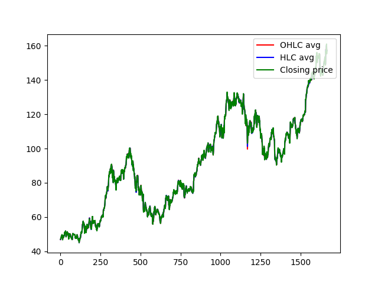
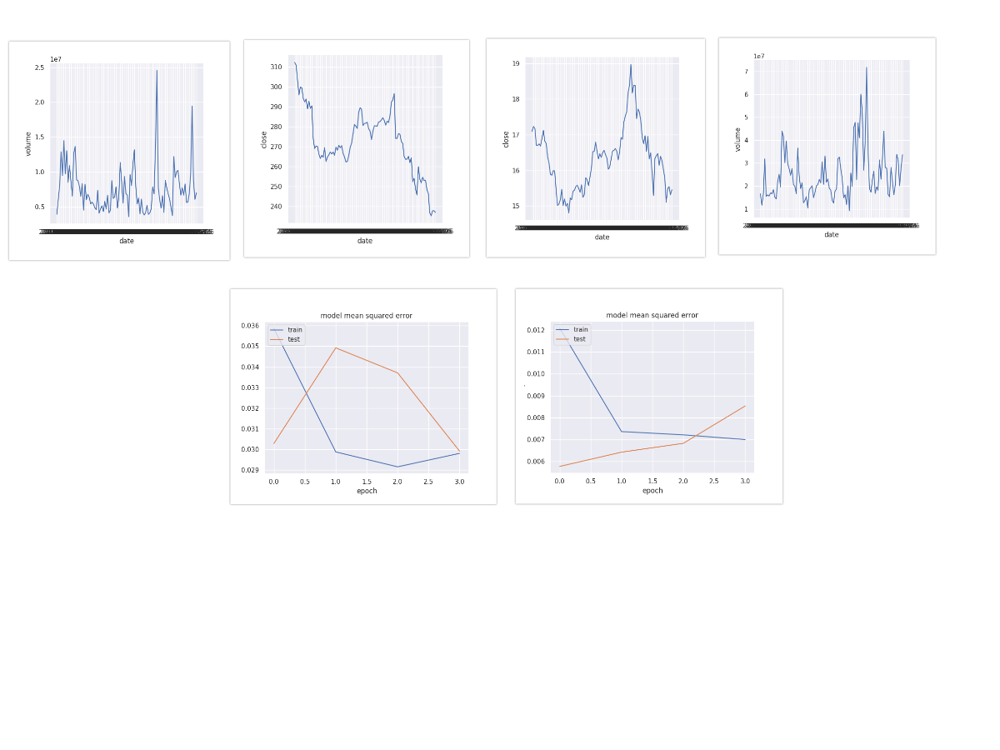

<a href="https://github.com/Shandilya21/stock_movement_prediction/issues"></a>
<a href="https://github.com/Shandilya21/stock_movement_prediction/network"></a>
<a href="https://github.com/Shandilya21/stock_movement_prediction/stargazers"></a>

<!--
*** Thanks for checking out this README Template. If you have a suggestion that would
*** make this better, please fork the repo and create a pull request or simply open
*** an issue with the tag "enhancement".
*** Thanks again! Now go create something AMAZING! :D
-->

<!-- PROJECT SHIELDS -->
<!--
*** I'm using markdown "reference style" links for readability.
*** Reference links are enclosed in brackets [ ] instead of parentheses ( ).
*** See the bottom of this document for the declaration of the reference variables
*** for contributors-url, forks-url, etc. This is an optional, concise syntax you may use.
*** https://www.markdownguide.org/basic-syntax/#reference-style-links
-->
<!-- [![Contributors][contributors-shield]][contributors-url]
[![Forks][forks-shield]][forks-url]
[![Stargazers][stars-shield]][stars-url]
[![Issues][issues-shield]][issues-url]
[![MIT License][license-shield]][license-url]
[![LinkedIn][linkedin-shield]][linkedin-url] -->


<!-- PROJECT LOGO -->
<br />
<p align="center">
  <a href="https://github.com/Shandilya21/stock_movement_prediction">
    
  </a>

  <h3 align="center">Predictive Model for Stock Price Movement</h3>
<!-- 
  <p align="center">
    An awesome README template to jumpstart your projects!
    <br />
    <a href="https://github.com/othneildrew/Best-README-Template"><strong>Explore the docs »</strong></a>
    <br />
    <br />
    <a href="https://github.com/othneildrew/Best-README-Template">View Demo</a>
    ·
    <a href="https://github.com/othneildrew/Best-README-Template/issues">Report Bug</a>
    ·
    <a href="https://github.com/othneildrew/Best-README-Template/issues">Request Feature</a>
  </p>
</p>

 -->

<!-- TABLE OF CONTENTS -->
## Table of Contents

* [About the Project](#about-the-project)
  * [Built With](#built-with)
* [Getting Started](#getting-started)
  * [Prerequisites](#prerequisites)
  * [Installation](#installation)
* [Usage](#usage)
* [Roadmap](#roadmap)
* [Contributing](#contributing)
* [Contact](#contact)

<!-- ABOUT THE PROJECT -->
## About The Project

<!-- [![Product Name Screen Shot][product-screenshot]] -->
This is a implementation of stock price movement considering the basic and fundamental analysis of stock market. Here, We consider Apple Inc. (APPL:NYSE) quarterly stock price to train our machine learning algorithms. The predicted value is close to the actual market price and hence it will also be useful even for more 'stocks', for eg: Microsoft (MSFT: NYSE), Google (GOOG,: NYSE) etc.   

Taking a deep dive interest in stock and market price movement, it is almost difficult for trader to study the market analysis for studying the important factors. Here we incorporated a end to end LSTM (Long Short Term Memory Network) algorithms to predict the price movement for refernce stock. Also it can compareable with multiple stocks before making an decision.

Why we need this?
* Stock market prediction is the act of trying to determine the future value of a company stock or other financial instrument traded on a financial exchange. The successful prediction of a stock's future price will maximize investor's gains.


### Built With
* [Python](https://www.python.org/)
* [Keras](https://keras.io/)
* [Scikit-Learn](https://scikit-learn.org/)


<!-- GETTING STARTED -->
## Getting Started
Below the the basic step to reproduce the code with few commands.

1. Clone the repository
```
git clone https://github.com/Shandilya21/stock_movement_prediction.git
```

### Prerequisites
```
pip install -r requirement.txt
```

<!-- USAGE EXAMPLES -->
## Usage

The code is working for Apple Inc. stock price, Also you can produce results for other sock prices and amake a comparable plot. The default number of epochs = 5. Feel free to set the epochs from Stockprediction.py. 

```
python3 Stockprediction.py   
```
## Results

<br />
<p align="center">
  <a href="https://github.com/Shandilya21/stock_movement_prediction">
    
  </a>

After epoch @5
```
Train RMSE: 1.78
Test RMSE: 2.99
Last Day Value: 166.8632354736328
Next Day Value: 176.5559539794922
```

After epoch @20
```
Train RMSE: 1.24
Test RMSE: 1.39
Last Day Value: 158.89990234375
Next Day Value: 157.1401824951172
```

### Stock Prediction with Technical Analysis

**Technical Analysis**: The study and use of price and volume charts and other technical indicators to make trading decisions. Technical analysis attempts to use past stock price and volume information to predict future price movements. Fundamentally, technical analysis shows in graphic form investor sentiment, both greed and fear. Understanding that concept is key to understanding technical analysis and being able to use it effectively to trade securities. With proper technical analysis, you can be ready for certain moves, and when your analysis is confirmed by the actual start of the move, trading positions can be taken. Technical analysis can be used for short-term trading or long-term position buying.

**Dataset**:
Data can be downloaded from the kaggle [(Data)](https://www.kaggle.com/dgawlik/nyse). Create and place the data inside the data folder.

**Technical Indicators**: There are list many technical indicators for several purpose, here we used mainly three types of Technical analysis to predict the next day stock prices. We have 501 stocks listed from NYSE dataset,(refer the dataset). The prototype work for all the stock names listed in the data.

The Technical Indicators are:
* [Relative Strength Index (RSI)](https://www.investopedia.com/terms/r/rsi.asp): The relative strength index (RSI) is a momentum indicator used in technical analysis that measures the magnitude of recent price changes to evaluate overbought or oversold conditions in the price of a stock or other asset. The RSI is displayed as an oscillator (a line graph that moves between two extremes) and can have a reading from 0 to 100.

* [Stochastic Oscillator](https://www.investopedia.com/terms/s/stochasticoscillator.asp#:~:text=A%20stochastic%20oscillator%20is%20a,moving%20average%20of%20the%20result): A stochastic oscillator is a momentum indicator comparing a particular closing price of a security to a range of its prices over a certain period of time. The sensitivity of the oscillator to market movements is reducible by adjusting that time period or by taking a moving average of the result. It is used to generate overbought and oversold trading signals, utilizing a 0-100 bounded range of values. 

* [Simple Moving Average (SMA)](https://www.investopedia.com/terms/s/sma.asp#:~:text=Key%20Takeaways-,A%20simple%20moving%20average%20(SMA)%20calculates%20the%20average%20of%20a,a%20bull%20or%20bear%20trend.): A simple moving average (SMA) calculates the average of a selected range of prices, usually closing prices, by the number of periods in that range 

The code is working for all the stock names listed in the data, Also you can produce results for other sock prices and amake a comparable plot. The default number of epochs = 5. Feel free to set the epochs from ```StockPreds_withtechnical.py```. Below is a demo for the setup.


#### Run Experiements
Before performing experiments, SET the config for the data path. In ```config.py``` Change the **DATA_PATH** to your data path location.

You can now perform the experiments and calculate the future prices for any stock name you want. refer the complete chart of stocks in ```data/price.csv.```
```
python StockPreds_withtechnical.py --stock_name GOOG --use_ta --indicator Stoch --epoch 5 (Stochastic Indicator)
python StockPreds_withtechnical.py --stock_name GOOG --use_ta --indicator RSI --epoch 5  (Relative Strength Index)
python StockPreds_withtechnical.py --stock_name AAPL --load_all --epoch 5  (SMA)
```
However,  I have prepared a shell script for testing. you can directly use this script to reproduce the results.
```
chmod +x run.sh
./run.sh
```

### Results
Here are few reported results related to few stocks with it's data chart
<br />
<p align="center">
  <a href="https://github.com/Shandilya21/stock_movement_prediction">
    
  </a>
<!--  -->

<!-- ROADMAP -->
## Roadmap

See the [open issues](https://github.com/Shandilya21/stock_movement_prediction/issues) for a list of proposed features (and known issues). Also, if you have any issue, feel free to open a new issue.

<!-- CONTRIBUTING -->
## Contributing

Contributions are very welcome. If you know how to make this code better, please open an issue. If you want to submit a pull request, please open an issue first.

### TODO
* Add Fundamental Analysis.
* Add Sentiment Analysis in Stock Prediction.
* Add Technical Indicators.

### References

* Market Study from [Investopedia](https://www.investopedia.com/)
* Data are scrapped from [NYSE](https://www.nyse.com/index)


<!-- LICENSE -->
<!-- ## License -->
Distributed under the MIT License. See `LICENSE` for more information.


<!-- CONTACT -->
## Contact
Arunav Shandilya - arunavshandilya96@gmail.com

<!-- Project Link: [https://github.com/your_username/repo_name](https://github.com/your_username/repo_name) -->


<!-- ACKNOWLEDGEMENTS
## Acknowledgements
* [GitHub Emoji Cheat Sheet](https://www.webpagefx.com/tools/emoji-cheat-sheet)
* [Img Shields](https://shields.io)
* [Choose an Open Source License](https://choosealicense.com)
* [GitHub Pages](https://pages.github.com)
* [Animate.css](https://daneden.github.io/animate.css)
* [Loaders.css](https://connoratherton.com/loaders)
* [Slick Carousel](https://kenwheeler.github.io/slick)
* [Smooth Scroll](https://github.com/cferdinandi/smooth-scroll)
* [Sticky Kit](http://leafo.net/sticky-kit)
* [JVectorMap](http://jvectormap.com)
* [Font Awesome](https://fontawesome.com)
 -->


<!-- MARKDOWN LINKS & IMAGES -->
<!-- https://www.markdownguide.org/basic-syntax/#reference-style-links -->
<!-- [contributors-shield]: https://img.shields.io/github/contributors/othneildrew/Best-README-Template.svg?style=flat-square
[contributors-url]: https://github.com/othneildrew/Best-README-Template/graphs/contributors
[forks-shield]: https://img.shields.io/github/forks/othneildrew/Best-README-Template.svg?style=flat-square
[forks-url]: https://github.com/Shandilya21/stock_movement_prediction/network/members
[stars-shield]: https://img.shields.io/github/stars/othneildrew/Best-README-Template.svg?style=flat-square
[stars-url]: https://github.com/othneildrew/Best-README-Template/stargazers
[issues-shield]: https://img.shields.io/github/issues/othneildrew/Best-README-Template.svg?style=flat-square
[issues-url]: https://github.com/othneildrew/Best-README-Template/issues
[license-shield]: https://img.shields.io/github/license/othneildrew/Best-README-Template.svg?style=flat-square
[license-url]: https://github.com/othneildrew/Best-README-Template/blob/master/LICENSE.txt
[linkedin-shield]: https://img.shields.io/badge/-LinkedIn-black.svg?style=flat-square&logo=linkedin&colorB=555
[linkedin-url]: https://linkedin.com/in/othneildrew
[product-screenshot]: plot/predicted_stock_price.png
 -->
